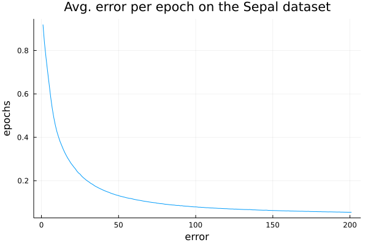
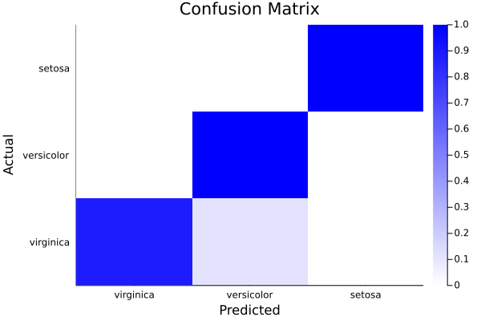
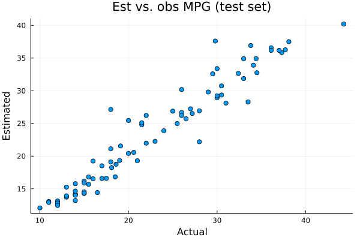

#  BetaML.jl Documentation

Welcome to the documentation of the [_Beta Machine Learning toolkit_](https://github.com/sylvaticus/BetaML.jl).

## About

The `BetaML` toolkit provides machine learning algorithms written in the Julia programming language.

Aside the algorithms themselves, `BetaML` provides many "utility" functions. Because algorithms are all self-contained in the library itself (you are invited to explore their source code by typing `@edit functionOfInterest(par1,par2,...)`), the utility functions have APIs that are coordinated with the algorithms, facilitating the "preparation" of the data for the analysis, the choice of the hyper-parameters or the evaluation of the models.
Most models have an interface for the [`MLJ`](https://github.com/alan-turing-institute/MLJ.jl) framework.

Aside Julia, BetaML can be accessed in R or Python using respectively [JuliaCall](https://github.com/Non-Contradiction/JuliaCall) and [PyJulia](https://github.com/JuliaPy/pyjulia). See [the tutorial](@ref using_betaml_from_other_languages) for details.

## Installation

The BetaML package is included in the standard Julia register, install it with:
* `] add BetaML`

## Available modules

While `BetaML` is split in several (sub)modules, all of them are re-exported at the root module level. This means that you can access their functionality by simply typing `using BetaML`:

```julia
using BetaML
myLayer = DenseLayer(2,3) # DenseLayer is defined in the Nn submodule
res     = KernelPerceptronClassifier() # KernelPerceptronClassifier is defined in the Perceptron module
@edit DenseLayer(2,3)     # Open a text editor with to the relevant source code
```
Each module is documented on the links below (you can also use the inline Julia help system: just press the question mark `?` and then, on the special help prompt `help?>`, type the function name):

- [**`BetaML.Perceptron`**](Perceptron.html): The Perceptron, Kernel Perceptron and PegasosClassifier classification algorithms;
- [**`BetaML.Trees`**](Trees.html): The Decision Trees and Random Forests algorithms for classification or regression (with missing values supported);
- [**`BetaML.Nn`**](Nn.html): Implementation of Artificial Neural Networks;
- [**`BetaML.Clustering`**](Clustering.html): (hard) Clustering algorithms (KMeans, KMdedoids)
- [**`BetaML.GMM`**](GMM.html): Various algorithms (Clustering, regressor, missing imputation / collaborative filtering / recommandation systems) that use a Generative (Gaussian) mixture models (probabilistic) fitter, fitted using a EM algorithm;
- [**`BetaML.Imputation`**](Imputation.html): Imputation algorithms;
- [**`BetaML.Utils`**](Utils.html): Various utility functions (scale, one-hot, distances, kernels, pca, accuracy/error measures..).

## [Available models](@id models_list)

Currently BetaML provides the following models:

| `BetaML` name | [`MLJ`](https://github.com/alan-turing-institute/MLJ.jl) Interface | Category* |
| ----------- | ------------- | -------- |
| [`PerceptronClassifier`](@ref) | [`LinearPerceptron`](@ref) | _Supervised classifier_ | 
| [`KernelPerceptronClassifier`](@ref)  | [`KernelPerceptron`](@ref) | _Supervised classifier_ | 
| [`PegasosClassifier`](@ref) | [`Pegasos`](@ref) | _Supervised classifier_ |
| [`DecisionTreeEstimator`](@ref) | [`DecisionTreeClassifier`](@ref), [`DecisionTreeRegressor`](@ref) | _Supervised regressor and classifier_ |
| [`RandomForestEstimator`](@ref) |  [`RandomForestClassifier`](@ref), [`RandomForestRegressor`](@ref) | _Supervised regressor and classifier_ |
| [`NeuralNetworkEstimator`](@ref) | [`NeuralNetworkRegressor`](@ref), [`MultitargetNeuralNetworkRegressor`](@ref), [`NeuralNetworkClassifier`](@ref) | _Supervised regressor and classifier_ |
| [`GMMRegressor1`](@ref) | | _Supervised regressor_ | 
| [`GMMRegressor2`](@ref) | [`GaussianMixtureRegressor`](@ref), [`MultitargetGaussianMixtureRegressor`](@ref) | _Supervised regressor_ | 
| [`KMeansClusterer`](@ref) | [`KMeans`](@ref) | _Unsupervised hard clusterer_ |
| [`KMedoidsClusterer`](@ref) | [`KMedoids`](@ref) | _Unsupervised hard clusterer_ |
| [`GMMClusterer`](@ref) | [`GaussianMixtureClusterer`](@ref)| _Unsupervised soft clusterer_ |
| [`FeatureBasedImputer`](@ref) | [`SimpleImputer`](@ref) | _Unsupervised missing data imputer_ |
| [`GMMImputer`](@ref) | [`GaussianMixtureImputer`](@ref), [`MultitargetGaussianMixtureImputer`](@ref)  | _Unsupervised missing data imputer_ |
| [`RFImputer`](@ref) | [`RandomForestImputer`](@ref) | _Unsupervised missing data imputer_ |
| [`UniversalImputer`](@ref) | [`GeneralImputer`](@ref) | _Unsupervised missing data imputer_ |
| [`MinMaxScaler`](@ref) | | _Data transformer_ |
| [`StandardScaler`](@ref) | | _Data transformer_ |
| [`Scaler`](@ref) |  | _Data transformer_ |
| [`PCA`](@ref) |  | _Unsupervised dimensionality reduction_ |
| [`OneHotEncoder`](@ref) |  | _Data transformer_ |
| [`OrdinalEncoder`](@ref) |  | _Data transformer_ |
| [`ConfusionMatrix`](@ref) | | _Predictions assessment_ |

\* There is no formal distinction in `BetaML` between a transformer, or also a model to assess predictions, and a unsupervised model. They are all treated as unsupervised models that given some data they lern how to return some useful information, wheter a class grouping, a specific tranformation or a quality evaluation..

## Usage

New to BetaML or even to Julia / Machine Learning altogether? [Start from the tutorial](@ref getting_started)!

All models supports the (a) model **construction** (where hyperparameters and options are choosen), (b) **fitting**  and (c) **prediction** paradigm. A few model support `inverse_transform`, for example to go back from the one-hot encoded columns to the original categorical variable (factor). 

This paradigm is described in detail in the [`API V2`](@ref api_usage) page.

## Quick examples

_(see the_ [tutorial](@ref getting_started) _for a more step-by-step guide to the examples below and to other examples)_

- **Using an Artificial Neural Network for multinomial categorisation**

In this example we see how to train a neural networks model to predict the specie's name (5th column) given floral sepals and petals measures (first 4 columns) in the famous [iris flower dataset](https://en.wikipedia.org/wiki/Iris_flower_data_set).


```julia
# Load Modules
using DelimitedFiles, Random
using Pipe, Plots, BetaML # Load BetaML and other auxiliary modules
Random.seed!(123);  # Fix the random seed (to obtain reproducible results).

# Load the data
iris     = readdlm(joinpath(dirname(Base.find_package("BetaML")),"..","test","data","iris.csv"),',',skipstart=1)
x        = convert(Array{Float64,2}, iris[:,1:4])
y        = convert(Array{String,1}, iris[:,5])
# Encode the categories (levels) of y using a separate column per each category (aka "one-hot" encoding) 
ohmod    = OneHotEncoder()
y_oh     = fit!(ohmod,y) 
# Split the data in training/testing sets
((xtrain,xtest),(ytrain,ytest),(ytrain_oh,ytest_oh)) = partition([x,y,y_oh],[0.8,0.2])
(ntrain, ntest) = size.([xtrain,xtest],1)

# Define the Artificial Neural Network model
l1   = DenseLayer(4,10,f=relu) # The activation function is `ReLU`
l2   = DenseLayer(10,3)        # The activation function is `identity` by default
l3   = VectorFunctionLayer(3,f=softmax) # Add a (parameterless  include("Imputation_tests.jl")) layer whose activation function (`softmax` in this case) is defined to all its nodes at once
mynn = NeuralNetworkEstimator(layers=[l1,l2,l3],loss=crossentropy,descr="Multinomial logistic regression Model Sepal", batch_size=2, epochs=200) # Build the NN and use the cross-entropy as error function.
# Alternatively, swith to hyperparameters auto-tuning with `autotune=true` instead of specify `batch_size` and `epoch` manually

# Train the model (using the ADAM optimizer by default)
res = fit!(mynn,fit!(Scaler(),xtrain),ytrain_oh) # Fit the model to the (scaled) data

# Obtain predictions and test them against the ground true observations
ŷtrain         = @pipe predict(mynn,fit!(Scaler(),xtrain)) |> inverse_predict(ohmod,_)  # Note the scaling and reverse one-hot encoding functions
ŷtest          = @pipe predict(mynn,fit!(Scaler(),xtest))  |> inverse_predict(ohmod,_) 
train_accuracy = accuracy(ŷtrain,ytrain) # 0.975
test_accuracy  = accuracy(ŷtest,ytest)   # 0.96

# Analyse model performances
cm = ConfusionMatrix()
fit!(cm,ytest,ŷtest)
print(cm)
```
```text
A ConfusionMatrix BetaMLModel (fitted)

-----------------------------------------------------------------

*** CONFUSION MATRIX ***

Scores actual (rows) vs predicted (columns):

4×4 Matrix{Any}:
 "Labels"       "virginica"    "versicolor"   "setosa"
 "virginica"   8              1              0
 "versicolor"  0             14              0
 "setosa"      0              0              7
Normalised scores actual (rows) vs predicted (columns):

4×4 Matrix{Any}:
 "Labels"       "virginica"   "versicolor"   "setosa"
 "virginica"   0.888889      0.111111       0.0
 "versicolor"  0.0           1.0            0.0
 "setosa"      0.0           0.0            1.0

 *** CONFUSION REPORT ***

- Accuracy:               0.9666666666666667
- Misclassification rate: 0.033333333333333326
- Number of classes:      3

  N Class      precision   recall  specificity  f1score  actual_count  predicted_count
                             TPR       TNR                 support                  

  1 virginica      1.000    0.889        1.000    0.941            9               8
  2 versicolor     0.933    1.000        0.938    0.966           14              15
  3 setosa         1.000    1.000        1.000    1.000            7               7

- Simple   avg.    0.978    0.963        0.979    0.969
- Weigthed avg.    0.969    0.967        0.971    0.966
```

```julia
ϵ = info(mynn)["lossPerEpoch"]
plot(1:length(ϵ),ϵ, ylabel="epochs",xlabel="error",legend=nothing,title="Avg. error per epoch on the Sepal dataset")
heatmap(info(cm)["categories"],info(cm)["categories"],info(cm)["normalised_scores"],c=cgrad([:white,:blue]),xlabel="Predicted",ylabel="Actual", title="Confusion Matrix")
```

 


- **Using Random forests for regression**

In this example we predict, using [another classical ML dataset](https://archive-beta.ics.uci.edu/ml/datasets/auto+mpg), the miles per gallon of various car models.

Note in particular:
- (a) how easy it is in Julia to import remote data, even cleaning them without ever saving a local file on disk;
- (b) how Random Forest models can directly work on data with missing values, categorical one and non-numerical one in general without any preprocessing 

```julia
# Load modules
using Random, HTTP, CSV, DataFrames, BetaML, Plots
import Pipe: @pipe
Random.seed!(123)

# Load data
urlData = "https://archive.ics.uci.edu/ml/machine-learning-databases/auto-mpg/auto-mpg.data"
data = @pipe HTTP.get(urlData).body                                                       |>
             replace!(_, UInt8('\t') => UInt8(' '))                                       |>
             CSV.File(_, delim=' ', missingstring="?", ignorerepeated=true, header=false) |>
             DataFrame;

# Preprocess data
X = Matrix(data[:,2:8]) # cylinders, displacement, horsepower, weight, acceleration, model year, origin, model name
y = data[:,1]           # miles per gallon
(xtrain,xtest),(ytrain,ytest) = partition([X,y],[0.8,0.2])

# Model definition, hyper-parameters auto-tuning, training and prediction
m      = RandomForestEstimator(autotune=true)
ŷtrain = fit!(m,xtrain,ytrain) # shortcut for `fit!(m,xtrain,ytrain); ŷtrain = predict(x,xtrain)`
ŷtest  = predict(m,xtest)

# Prediction assessment
relative_mean_error_train = relative_mean_error(ytrain,ŷtrain) # 0.039
relative_mean_error_test  = relative_mean_error(ytest,ŷtest)   # 0.076
scatter(ytest,ŷtest,xlabel="Actual",ylabel="Estimated",label=nothing,title="Est vs. obs MPG (test set)")
```



- **Further examples**

Finally, you may want to give a look at the ["test" folder](https://github.com/sylvaticus/BetaML.jl/tree/master/test). While the primary objective of the scripts under the "test" folder is to provide automatic testing of the BetaML toolkit, they can also be used to see how functions should be called, as virtually all functions provided by BetaML are tested there.


## Acknowledgements

The development of this package at the _Bureau d'Economie Théorique et Appliquée_ (BETA, Nancy) was supported by the French National Research Agency through the [Laboratory of Excellence ARBRE](http://mycor.nancy.inra.fr/ARBRE/), a part of the “Investissements d'Avenir” Program (ANR 11 – LABX-0002-01).

[](hhttp://www.beta-umr7522.fr/)
